# Threaded File Copier

This project is a Python script designed for recursive copying of large numbers of files from a source directory to a destination directory. It implements the **Producer–Consumer** design pattern using **Threading** to handle concurrent I/O operations and maximize throughput.

## 🚀 Features

* **Multithreading:** Uses the standard `threading` module to run multiple concurrent operations. Since file copying is primarily an **I/O-bound task** (waiting for disk reads/writes), threading allows for efficient execution without the heavy memory overhead and complexity of multiple processes.
* **Producer–Consumer Pattern:**
    * **Producer:** A single thread traverses the directory tree and indexes files into a `queue.Queue`.
    * **Consumers:** A pool of worker threads picks up tasks from the queue and performs the actual copying.
* **Configuration File:** Settings are loaded from a `config.json` file, allowing changes without modifying the source code.
* **Custom Logging:** Integrated `Logger` class that writes detailed operation info and errors to a specified log file.
* **Metadata Preservation:** Uses `shutil.copy2` to ensure copied files retain their original creation and modification timestamps.
* **Robustness:** Automatically creates missing target directories and handles structure mirroring.
* **Statistics:** Displays the total number of files found, total size, and execution time upon completion.

## 📂 Project Structure

* `main.py` – The entry point. Loads configuration, initializes the logger, and starts the copier.
* `ThreadedFileCopier.py` – Core logic containing the `ThreadedFileCopier` class with Threading implementation.
* `ConfigurationLoader.py` – Handles loading and parsing of the JSON configuration.
* `Logger.py` – Custom logging class for handling file outputs.
* `lib/ReadableSize.py` – Helper module to convert bytes into human-readable formats (KB, MB, GB).
* `config.json` – Configuration file (must be created/edited by the user).

```mermaid
graph TD
    %% Styly
    classDef config fill:#f9f,stroke:#333,stroke-width:2px;
    classDef threads fill:#e1f5fe,stroke:#0277bd,stroke-width:2px;
    classDef queue fill:#fff9c4,stroke:#fbc02d,stroke-width:2px,stroke-dasharray: 5 5;
    classDef action fill:#e8f5e9,stroke:#2e7d32,stroke-width:2px;

    Start((Start)) --> Load[Načtení Konfigurace & Loggeru]
    Load --> Init[Inicializace ParallelFileCopier]
    Init -->|Spuštění| Threads[Spuštění vláken]

    subgraph "Paralelní zpracování"
        direction TB
        
        Threads --> Producer[Producer Vlákno]
        Threads --> Consumers[Consumer Vlákna x4]
        
        Producer -->|1. Prohledá složku| Walk[os.walk Source]
        Walk -->|2. Vloží cesty souborů| Q[(Fronta / Queue)]
        
        Q -->|3. Vyzvedne úlohu| Consumers
        Consumers -->|4. Kopíruje soubor| Copy[Zápis na disk]
        
        Copy -->|Logování| Logger[Zápis do Logu]
    end

    Producer -->|Konec souborů| FinishP[Ukončení Producenta]
    Consumers -->|Fronta prázdná| FinishC[Ukončení Workerů]
    
    FinishP --> Join[Čekání na dokončení]
    FinishC --> Join
    Join --> End((Konec))

    class Load,Init config;
    class Producer,Consumers threads;
    class Q queue;
    class Walk,Copy action;
```



## 🛠️ Requirements

* **Python 3.x**
* **Standard Libraries only:** `os`, `threading`, `queue`, `shutil`, `time`, `json` (No `pip install` required).

## ⚙️ Usage

### 1. Clone the repository

```bash
git clone <repository-url>
cd <repository-folder>
```

### 2. Create and Edit the Configuration File

Create a file named `config.json` in the root directory. You can copy the example below.

> **⚠️ IMPORTANT:** You must update the source and destination paths in this file to match your actual directory structure before running the script.

```json
{
  "source": "D:\\Photos\\Source_Folder",
  "destination": "E:\\Backup\\Destination_Folder",
  "threads": 8,
  "log_file": "logs/app.log"
}
```


